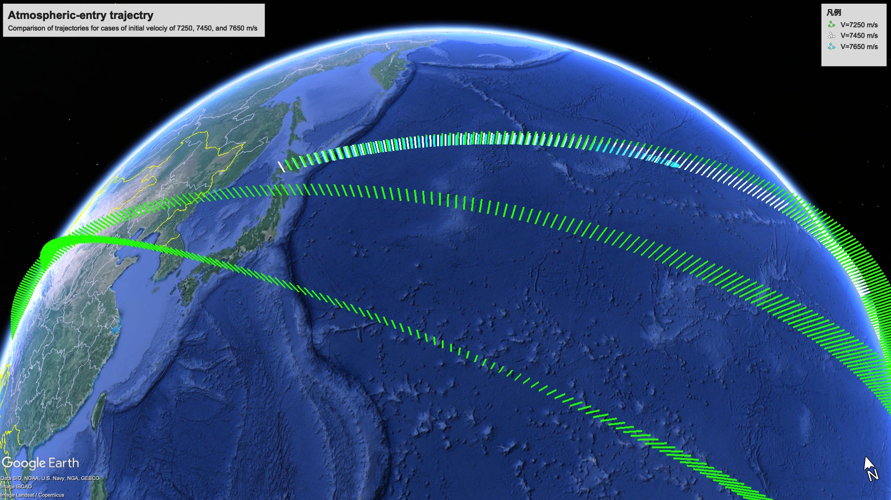

# Tacode
Trajectory analysis code


# Code description

`Tacode` solves the equation of motion of a point-mass object in three degrees of freedom on an Earth-centered, Earth-fixed (ECEF) noninertial frame by a python script.
The planetary gravity, Coriolis, centrifugal, and aerodynamic forces act on this point mass.
The gravity force is obtained by differentiating the gravitational potential considering J20, J22, J30, and J40.
The aerodynamic force is given by atmospheric density, drag coefficient, characteristic (projection) area, and velocity.
The atmospheric data is given by NRLMSISE-00 Atmosphere Model.
The equation of motion is numerically solved using fourth-order Runge-Kutta method in four stages.
Figure 1 shows a comparison of computed trajectories for cases of the initial velocity of 7250, 7450, and 7650 m/s, which is calculated by `Tacode`.


## Governing equation

The governing equations are the three-degree-of-freedom motion equations for a mass point in a non-inertial coordinate system: the Earth-Centered Earth-Fixed (ECEF) coordinate systemm, which is express by

```math
	m \frac { { \partial  }^{ 2 } {\boldsymbol x} }{ \partial { t }^{ 2 } } = 
	{\boldsymbol F}_{\rm grav} 
	- 2m{ \boldsymbol \omega }\times \frac { { \partial  } {\boldsymbol x} }{ \partial { t } } 
	- m {\boldsymbol  \omega  }\times \left( { \boldsymbol \omega  }\times { \boldsymbol x } \right) 
	+ {\boldsymbol F}_{\rm aero} ,
```

where, $t$ is time, ${\boldsymbol x}$ and $m$ are the position vector of the mass point and its mass, respectively, and ${\boldsymbol \omega}$ denotes the angular velocity vector.
For the Earth where the coordinate system rotates around the $z$-axis, ${\boldsymbol \omega}=(0, 0, 7.292115\times10^{-5})$ rad/s.
Here, $`{\boldsymbol F}_{\rm grav}`$ is the force of gravity and $`{\boldsymbol F}_{\rm aero}`$ is the aerodynamic force.

### Gravity Force

Because the Earth is a spheroid shape where the radii at the equator and the poles are different due to its rotation, it is convienient to describe the potential with spherical harmonics in polar coordinates [@CWagner1966], which can be represented as a summation of $J$ terms as follows:

$$
\begin{aligned}
	U =& - \frac{G M}{r} 
	\left[ 1
	- \left( \frac{a_{e}}{r} \right)^2 J_{20} \frac{ 3 \sin^2 \beta - 1}{2} 
	- \left( \frac{a_{e}}{r} \right)^2 J_{22} 3 \cos^2 \beta \cos 2 \left( \alpha + \alpha_{22} \right) \right. 
	\\
	& \left.
	- \left( \frac{a_{e}}{r} \right)^3 J_{30} \frac{ 5 \sin^3 \beta - 3 \sin \beta}{2}  
	- \left( \frac{a_{e}}{r} \right)^4 J_{40} \frac{35}{8} \left( \sin^4 \beta - 30 \sin^2 \beta + 3 \right) \right] .
\end{aligned}
$$

Here, $G$ is the universal gravitational constant, $M$ is the planetary mass, and $r$ represents the radial distance. 
For Earth, $`G=6.67408\times10^{-11}`$ $`{\rm m}^3`$/{kg$`\cdot`$s$`^2`$} and $M=5.9722\times10^{24}$ kg are given.
In addition, $a_e$ represents the planet's equatorial radius, while $J_{20}$, $J_{22}$, $J_{30}$, $J_{40}$, and $\alpha_{22}$ are the dynamic form factors associated with the planet's shape given by the reference [@liu2019guidance]. 
By taking partial derivatives of this potential with respect to each coordinate components, the gravity in the polar coordinate system, denoted as $`\boldsymbol{F}_{grav}^{'}=(F_{g_r}^{'}, F_{g_{\alpha}}^{'}, F_{g_{\beta}}^{'})`$, are expressed as follows.

$$
\begin{aligned}
	F_{g_r}^{'}
	=& \frac{GMm}{r^2} 
	\left[ 
	- 1
	+ \frac{3}{2} \left( \frac{a_{e}}{r} \right)^2 J_{20} \left( 3 \sin^2 \beta - 1 \right)
	+ 9 \left( \frac{a_{e}}{r} \right)^2 J_{22} \left( \cos^2 \beta \right) \cos 2 \left( \alpha + \alpha_{22} \right)
	\right.
	\\
	&
	\left.
	+ 2 \left( \frac{a_{e}}{r} \right)^3 J_{30} \left( 5 \sin^3 \beta - 3 \sin \beta \right)
	+ \frac{5}{8} \left( \frac{a_{e}}{r} \right)^4 J_{40} \left( 35 \sin^4 \beta -30 \sin^2 \beta + 3  \right)
	\right] , 
	\\
	F_{g_{\alpha}}^{'} 
	=& \frac{GMm}{r^2} 
	\left[ 
	6 \left( \frac{a_{e}}{r} \right)^2 J_{22}  \cos \beta \sin 2 \left( \alpha + \alpha_{22} \right)
	\right] , 
	\\
	F_{g_{\beta}}^{'} 
	=& \frac{GMm}{r^2} 
	\left[ 
	- 3 \left( \frac{a_{e}}{r} \right)^2 J_{20} \left( \sin \beta \cos \beta \right)
	+ 6 \left( \frac{a_{e}}{r} \right)^2 J_{22} \left( \sin \beta \cos \beta \right) \cos 2 \left( \alpha + \alpha_{22} \right) 
	\right.
	\\
	&
	\left.
	-  \frac{3}{2} \left( \frac{a_{e}}{r} \right)^3 J_{30} \left( 5 \sin^2 \beta - 1 \right) \cos \beta
	- \frac{5}{2} \left( \frac{a_{e}}{r} \right)^4 J_{40} \left( 7 \sin^2 \beta - 3 \right) \sin \beta \cos \beta
	\right] .
\end{aligned}
$$

By transformation from polar coordinates to the Cartesian coordinate system, the gravitational force $\boldsymbol{F}_{grav}$ in the Cartesian coordinate system can be obtained.

### Aerodynamic Force

In the Cartesian coordinate system, the aerodynamic force acting on the point mass is described as a drag force in the direction of motion, given by the following equation:

$$
\begin{aligned}
	\boldsymbol{F}_{\rm aero} = - \frac{1}{2} \rho C_D S \left| \boldsymbol{v} \right|^2 \frac{ \boldsymbol{v} }{\left| \boldsymbol{v} \right|} ,
\end{aligned}
$$

where, $\boldsymbol{v}$ is the velocity vector, $\rho$ is the air density, $C_D$ is the drag coefficient, and $S$ is the characteristic area.
The atmospheric density is given by reading data by NRLMSISE-00 Atmosphere Model.


## Coordinate Transformation

The equations of motion are solved in a Cartesian coordinate system. 
However, for initial conditions such as initial position and velocity, atmospheric density model, and output formats, it is convenient to use the geodetic coordinate system, which represents latitude, longitude, and altitude coordinates. 
In addition, the gravity forces are calculated through the use of Polar coordinates. 
`Tacode` includes the coordinate transformation modules among the Cartesian coordinate,  WGS84 geodetic [@WGS84], and polar coordinate systems.


# How to start calculation

## Trajectory simulation

```console
python3 src/tacode.py
```

Tutorial case: `testcase/work`


## Monte-Carlo simulation

```console
python3 src/tacode-montecarlo.py
```

Tutorial case: `testcase/work_montecarlo`


## Configuration file

Trajectory simulation by `Tacode` is controled by the configuration file: `config.yml`.

## Requirements

`Tacode` requires the following packages:
- numpy (>=1.15.4)
- yaml (>= 3.11)
- simplekml (>= 1.3.2)
- gpxpy (>= 1.3.5)


# Contact:

Yusuke Takahashi, Hokkaido University

ytakahashi@eng.hokudai.ac.jp


# References

- Yusuke Takahashi, Masahiro Saito, Nobuyuki Oshima, and Kazuhiko Yamada, “Trajectory Reconstruction for Nanosatellite in Very Low Earth Orbit Using Machine Learning.” Acta Astronautica 194: 301–8. 2022. https://doi.org/https://doi.org/10.1016/j.actaastro.2022.02.010.
- Wagner, Carl. A. 1971. “The Gravity Potential And Force Field of the Earth Through Fourth Order.” NASA TN D-3317, 1–60.
- Fucheng Liu, Shan Lu, and Yue Sun, Guidance and Control Technology of Spacecraft on Elliptical Orbit. Springer, 2019.
- NRLMSISE-00 Atmosphere Model
- Defense Mapping Agency, “Department of Defense World Geodetic System 1984: its definition and relationships with local geodetic system“, 8350, 1987