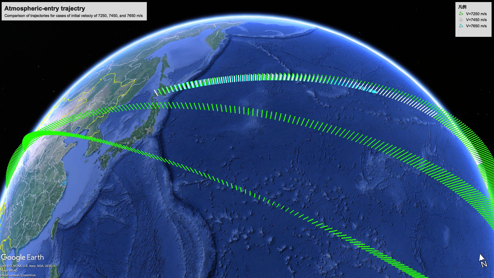

# Tacode
Trajectory analysis code

[](https://github.com/ytakahashi3123/tacode/actions/workflows/tests.yml)


# Code description

`Tacode` solves the equation of motion of a point-mass object in three degrees of freedom on an Earth-centered, Earth-fixed (ECEF) noninertial frame by a python script.
The planetary gravity, Coriolis, centrifugal, and aerodynamic forces act on this point mass.
The gravity force is obtained by differentiating the gravitational potential considering J20, J22, J30, and J40.
The aerodynamic force is given by atmospheric density, drag coefficient, characteristic (projection) area, and velocity.
The atmospheric data is given by NRLMSISE-00 Atmosphere Model.
The equation of motion is numerically solved using fourth-order Runge-Kutta method in four stages.



The trajectories above were written to `geodetic.kml` by the KML output and rendered
in Google Earth. They are the `tutorial/work_reentry` case (7450 m/s) together with
two runs of the same configuration at 7250 and 7650 m/s.

## Governing equation

The governing equations are the three-degree-of-freedom motion equations for a mass point in a non-inertial coordinate system: the Earth-Centered Earth-Fixed (ECEF) coordinate systemm, which is express by

```math
	m \frac { { \partial  }^{ 2 } {\boldsymbol x} }{ \partial { t }^{ 2 } } = 
	{\boldsymbol F}_{\rm grav} 
	- 2m{ \boldsymbol \omega }\times \frac { { \partial  } {\boldsymbol x} }{ \partial { t } } 
	- m {\boldsymbol  \omega  }\times \left( { \boldsymbol \omega  }\times { \boldsymbol x } \right) 
	+ {\boldsymbol F}_{\rm aero} ,
```

where, $t$ is time, ${\boldsymbol x}$ and $m$ are the position vector of the mass point and its mass, respectively, and ${\boldsymbol \omega}$ denotes the angular velocity vector.
For the Earth where the coordinate system rotates around the $z$-axis, ${\boldsymbol \omega}=(0, 0, 7.292115\times10^{-5})$ rad/s.
Here, $`{\boldsymbol F}_{\rm grav}`$ is the force of gravity and $`{\boldsymbol F}_{\rm aero}`$ is the aerodynamic force.

### Gravity Force

Because the Earth is a spheroid shape where the radii at the equator and the poles are different due to its rotation, it is convienient to describe the potential with spherical harmonics in polar coordinates [@CWagner1966], which can be represented as a summation of $J$ terms as follows:

```math
	U = - \frac{G M}{r} 
	\left[ 1
	- \left( \frac{a_{e}}{r} \right)^2 J_{20} \frac{ 3 \sin^2 \beta - 1}{2} 
	- \left( \frac{a_{e}}{r} \right)^2 J_{22} 3 \cos^2 \beta \cos 2 \left( \alpha + \alpha_{22} \right) 
	- \left( \frac{a_{e}}{r} \right)^3 J_{30} \frac{ 5 \sin^3 \beta - 3 \sin \beta}{2}  
	- \left( \frac{a_{e}}{r} \right)^4 J_{40} \frac{1}{8} \left( 35 \sin^4 \beta - 30 \sin^2 \beta + 3 \right) \right] .
```

Here, $G$ is the universal gravitational constant, $M$ is the planetary mass, and $r$ represents the radial distance. 
For Earth, $`G=6.67408\times10^{-11}`$ $`{\rm m}^3`$/{kg$`\cdot`$s$`^2`$} and $M=5.9722\times10^{24}$ kg are given.
In addition, $a_e$ represents the planet's equatorial radius, while $J_{20}$, $J_{22}$, $J_{30}$, $J_{40}$, and $\alpha_{22}$ are the dynamic form factors associated with the planet's shape given by the reference [@liu2019guidance]. 
By taking partial derivatives of this potential with respect to each coordinate components, the gravity in the polar coordinate system, denoted as $`\boldsymbol{F}_{grav}^{'}=(F_{g_r}^{'}, F_{g_{\alpha}}^{'}, F_{g_{\beta}}^{'})`$, are expressed as follows.

$$
\begin{aligned}
	F_{g_r}^{'}
	=& \frac{GMm}{r^2} 
	\left[ 
	- 1
	+ \frac{3}{2} \left( \frac{a_{e}}{r} \right)^2 J_{20} \left( 3 \sin^2 \beta - 1 \right)
	+ 9 \left( \frac{a_{e}}{r} \right)^2 J_{22} \left( \cos^2 \beta \right) \cos 2 \left( \alpha + \alpha_{22} \right)
	+ 2 \left( \frac{a_{e}}{r} \right)^3 J_{30} \left( 5 \sin^3 \beta - 3 \sin \beta \right)
	+ \frac{5}{8} \left( \frac{a_{e}}{r} \right)^4 J_{40} \left( 35 \sin^4 \beta -30 \sin^2 \beta + 3  \right)
	\right] , \\
	F_{g_{\alpha}}^{'} 
	=& \frac{GMm}{r^2} 
	\left[ 
	6 \left( \frac{a_{e}}{r} \right)^2 J_{22}  \cos \beta \sin 2 \left( \alpha + \alpha_{22} \right)
	\right] , \\
	F_{g_{\beta}}^{'} 
	=& \frac{GMm}{r^2} 
	\left[ 
	- 3 \left( \frac{a_{e}}{r} \right)^2 J_{20} \left( \sin \beta \cos \beta \right)
	+ 6 \left( \frac{a_{e}}{r} \right)^2 J_{22} \left( \sin \beta \cos \beta \right) \cos 2 \left( \alpha + \alpha_{22} \right)
	-  \frac{3}{2} \left( \frac{a_{e}}{r} \right)^3 J_{30} \left( 5 \sin^2 \beta - 1 \right) \cos \beta
	- \frac{5}{2} \left( \frac{a_{e}}{r} \right)^4 J_{40} \left( 7 \sin^2 \beta - 3 \right) \sin \beta \cos \beta
	\right] .
\end{aligned}
$$

By transformation from polar coordinates to the Cartesian coordinate system, the gravitational force $\boldsymbol{F}_{grav}$ in the Cartesian coordinate system can be obtained.

### Aerodynamic Force

In the Cartesian coordinate system, the aerodynamic force acting on the point mass is described as a drag force in the direction of motion, given by the following equation:

$$
\begin{aligned}
	\boldsymbol{F}_{\rm aero} = - \frac{1}{2} \rho C_D S \left| \boldsymbol{v} \right|^2 \frac{ \boldsymbol{v} }{\left| \boldsymbol{v} \right|} ,
\end{aligned}
$$

where, $\boldsymbol{v}$ is the velocity vector, $\rho$ is the air density, $C_D$ is the drag coefficient, and $S$ is the characteristic area.
The atmospheric density is given by reading data by NRLMSISE-00 Atmosphere Model.


## Coordinate Transformation

The equations of motion are solved in a Cartesian coordinate system. 
However, for initial conditions such as initial position and velocity, atmospheric density model, and output formats, it is convenient to use the geodetic coordinate system, which represents latitude, longitude, and altitude coordinates. 
In addition, the gravity forces are calculated through the use of Polar coordinates. 
`Tacode` includes the coordinate transformation modules among the Cartesian coordinate,  WGS84 geodetic [@WGS84], and polar coordinate systems.


# How to start calculation

`Tacode` reads `config.yml` from the **current directory**, and writes its output there.
Run it from a case directory, not from the repository root.

## Trajectory simulation

```console
cd tutorial/work
./run_tacode.sh
```

or directly:

```console
cd tutorial/work
python3 ../../src/tacode.py
```

Tutorial case: `tutorial/work`.
`tutorial_template` is the template used to create a new case (copy it to a new directory).

Output is written to the directories named in `config.yml`:

| Directory | File | Description |
|---|---|---|
| `output_result` | `tecplot.dat` | Trajectory in Tecplot point format |
| `output_result` | `geodetic.kml` | Ground track for Google Earth |
| `output_restart` | `restart.dat` | State in ECEF Cartesian coordinates |

## Monte-Carlo simulation

```console
cd tutorial/work_montecarlo
./run_tacode-mc.sh
```

Tutorial case: `tutorial/work_montecarlo`.
It copies `tutorial_template` for each case and runs them in parallel
(`number_iteration` cases, up to `maximum_number_execution` at a time).


## Configuration file

Trajectory simulation by `Tacode` is controled by the configuration file: `config.yml`.

## Tests

```console
./run_tests.sh              # run everything
./run_tests.sh -v           # verbose
./run_tests.sh test_kepler  # one module
```

The tests live in `test/` and use only the standard library's `unittest`, so they
need nothing beyond what `Tacode` itself requires. They cover:

| Module | What it checks |
|---|---|
| `test_coordinate_system.py` | Round trips between the Cartesian, geodetic and polar systems; behaviour at longitude 180 deg, at the poles and on the equator |
| `test_force_term.py` | The gravity vector equals `-grad U` for a potential written independently from the README; the Coriolis, centrifugal and drag terms |
| `test_kepler.py` | Energy and angular momentum are conserved in the two-body limit (J terms, rotation and drag switched off); RK4 converges at fourth order |
| `test_atmosphere.py` | Table interpolation reproduces the nodes, clamps outside the table range, and scales the Knudsen number with the characteristic length |
| `test_solver_invariants.py` | The time loop stops at the requested time, all history arrays share one length, the atmospheric values line up with the position of the same index, and the Tecplot header matches the number of rows |

`test/smoke_tutorial.py` is separate from the suite above: it runs the tutorial
case end to end in a temporary directory and inspects the three output files.
It needs `simplekml`, which the unit tests do not.

```console
python3 test/smoke_tutorial.py
```

### Continuous integration

`.github/workflows/tests.yml` runs on every push to `main` and on every pull
request:

| Job | What it does |
|---|---|
| `unit` | The test suite on Python 3.9, 3.10, 3.11, 3.12 and 3.13 |
| `tutorial` | The tutorial case end to end, through `run_tacode.sh`, and a check that a bad configuration exits with a non-zero code |
| `setup-script` | `setup_env.sh` on a machine without the packages, then the suite using the `.venv` it built |

## Requirements

`Tacode` needs Python 3.9 or later and the following packages.

| Package | Version | Used for |
|---|---|---|
| numpy | >= 1.15.4 | Arrays and linear algebra throughout |
| scipy | >= 1.4.0 | Interpolation of the atmosphere and aerodynamic tables |
| PyYAML | >= 3.11 | Reading `config.yml` (imported as `yaml`) |
| simplekml | >= 1.3.2 | KML output (`post_process.kml.flag_output`) |

Optional:

| Package | Version | Used for |
|---|---|---|
| gpxpy | >= 1.3.5 | GPX output only, which is disabled in `output_routine()` |

Beyond these, `Tacode` uses only the Python standard library:
`argparse`, `os`, `random`, `shutil`, `subprocess`, `sys`.

```console
python3 -m pip install -r requirements.txt
```

Versions verified by the developer (2026-09-05): Python 3.12.3 with
numpy 2.2.6 / scipy 1.15.3 / PyYAML 6.0.2 / simplekml 1.3.6, and also with
numpy 2.5.2 / scipy 1.18.1 / PyYAML 6.0.3 / simplekml 1.3.2.

### Optional: build a virtual environment

If those packages are not available, `setup_env.sh` creates a Python virtual
environment in `.venv` and installs them. This is optional — if you already have
a working interpreter, keep using it and ignore this script.

```console
./setup_env.sh              # build .venv and install
./setup_env.sh --check      # only report what is missing, install nothing
./setup_env.sh --help       # all options
```

Once `.venv` exists, `run_tacode.sh` uses it automatically. The interpreter is
resolved in this order:

1. `$TACODE_PYTHON`, if set — `TACODE_PYTHON=/path/to/python ./run_tacode.sh`
2. `.venv/bin/python` at the repository root, if it exists
3. `python3`

With no `.venv` and no `TACODE_PYTHON`, the scripts behave exactly as before.


# Notes and current limitations

## Reference frame of the initial velocity

The initial **position** (`initial_settings.coordinate`) is given in the **WGS84 geodetic**
system as longitude [deg], latitude [deg], and altitude [km].

The initial **velocity** (`initial_settings.velocity`) is, however, interpreted in the local
frame of the **geocentric** latitude and longitude, as [east, north, up] in m/s.
The "north" and "up" directions of the two systems differ by up to the flattening angle
(about 0.19 deg). The Tecplot output uses the same geocentric frame, so a run is
self-consistent, but take this distinction into account when comparing with external data.

## Atmosphere table format

Two formats are accepted, and the format is detected from the file itself:

| Format | Recognised by | Produced by |
|---|---|---|
| CCMC / VITMO | a line reading `Selected parameters are:` | the NRLMSISE-00 form at [CCMC](https://ccmc.gsfc.nasa.gov/) |
| NRLMSISE-00 Fortran | a line starting `1, ALTITUDE` | `NRLMSISE-00_readctl.FOR` writing the table directly |

Both give the same seven columns: height, O, N2, O2, total mass density, neutral
temperature, N. Rows that are not seven numbers are skipped, so trailing blank or
comment lines are harmless.

Two tables are supplied in `database/atmosphere`. Switch between them with
`atmosphere.filename_atmosphere` alone — the format is detected, so nothing else
changes.

| File | Altitude | Profile | Solar activity |
|---|---|---|---|
| `atmospheremodel.txt` (default) | 0–400 km | single point, 55°N 45°E | 2015-01-01, site default F10.7 |
| `atmospheremodel_700km.txt` | 0–700 km | mean over 50°S–50°N × all longitudes | F10.7 = 76.6 (low activity) |

`database/atmosphere/README.md` records how each was generated and why they are not
interchangeable — the density at 400 km differs by a factor of 2.17 between them.

Two cautions when swapping tables:

- **The solar activity must match your case.** Two tables generated for different
  F10.7 differ by a factor of two in density at 400 km, which changes the drag by
  the same factor.
- **The Knudsen number is built from N2, O2, N and O only.** Those are 96% of the
  mass at 400 km but only 35% at 700 km, where helium dominates. The drag
  coefficient is flat over that range, so the effect on the trajectory is
  negligible, but the Knudsen number itself is increasingly approximate above
  roughly 500 km.

## Atmosphere table range

The atmosphere table (`database/atmosphere/atmospheremodel.txt`, NRLMSISE-00) covers
0–400 km, while the tutorial orbit reaches 522 km. Above the top of the table the
properties are extrapolated:

```math
\rho(z) = \rho_{\rm top} \exp \left( - \frac{z - z_{\rm top}}{H} \right)
```

The upper thermosphere is close to isothermal and in diffusive equilibrium, so this is the
physically appropriate form rather than an ad-hoc fit. The scale height $H$ is not a
hard-coded constant: it is fitted to the top 50 km of whichever table is loaded, so
replacing the table changes it automatically. For the table shipped here the fit gives
47.8 km, which agrees with $kT/(m_{\rm O} g) = 49.3$ km — atomic oxygen makes up 96% of
the mass at 400 km.

The temperature is held at its value at the top of the table (the region is isothermal),
and the Knudsen number is scaled inversely with the density.

Set `atmosphere.kind_extrapolation` to `clamp` to restore the earlier behaviour, in which
the values were held at those of the top of the table. That overestimates the density by a
factor of 11 at 522 km, which moves the position by 93 m after one orbit and by 14 km
after nine.

Extrapolation is a safety net, not a substitute for data: extending the table itself is
better whenever the trajectory spends a long time above it.

## Restart

Restart (`computational_setup.flag_initial: False`) is **not implemented** in this version;
the code stops with a message. `output_restart/restart.dat` is written on every run, but it
currently stores the whole history rather than the final state only.


# Contact:

Yusuke Takahashi, Hokkaido University

ytakahashi@eng.hokudai.ac.jp


# References

- Yusuke Takahashi, Masahiro Saito, Nobuyuki Oshima, and Kazuhiko Yamada, “Trajectory Reconstruction for Nanosatellite in Very Low Earth Orbit Using Machine Learning.” Acta Astronautica 194: 301–8. 2022. https://doi.org/https://doi.org/10.1016/j.actaastro.2022.02.010.
- Wagner, Carl. A. 1971. “The Gravity Potential And Force Field of the Earth Through Fourth Order.” NASA TN D-3317, 1–60.
- Fucheng Liu, Shan Lu, and Yue Sun, Guidance and Control Technology of Spacecraft on Elliptical Orbit. Springer, 2019.
- NRLMSISE-00 Atmosphere Model
- Defense Mapping Agency, “Department of Defense World Geodetic System 1984: its definition and relationships with local geodetic system“, 8350, 1987